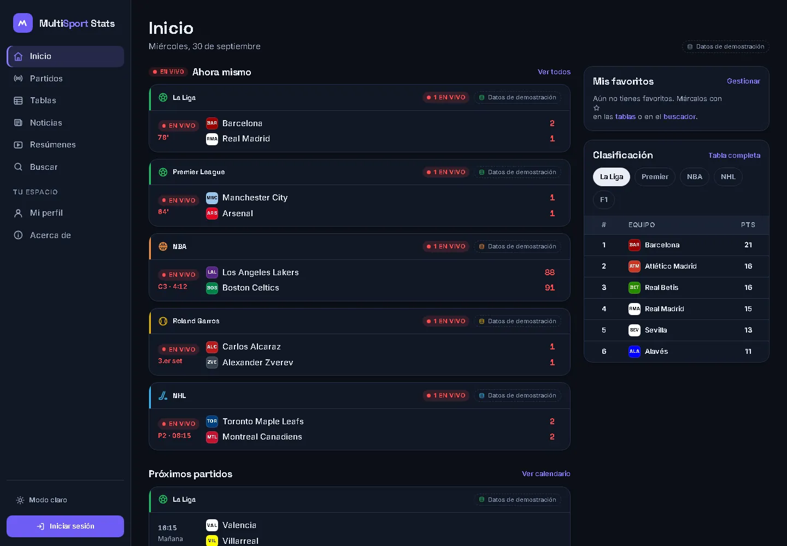
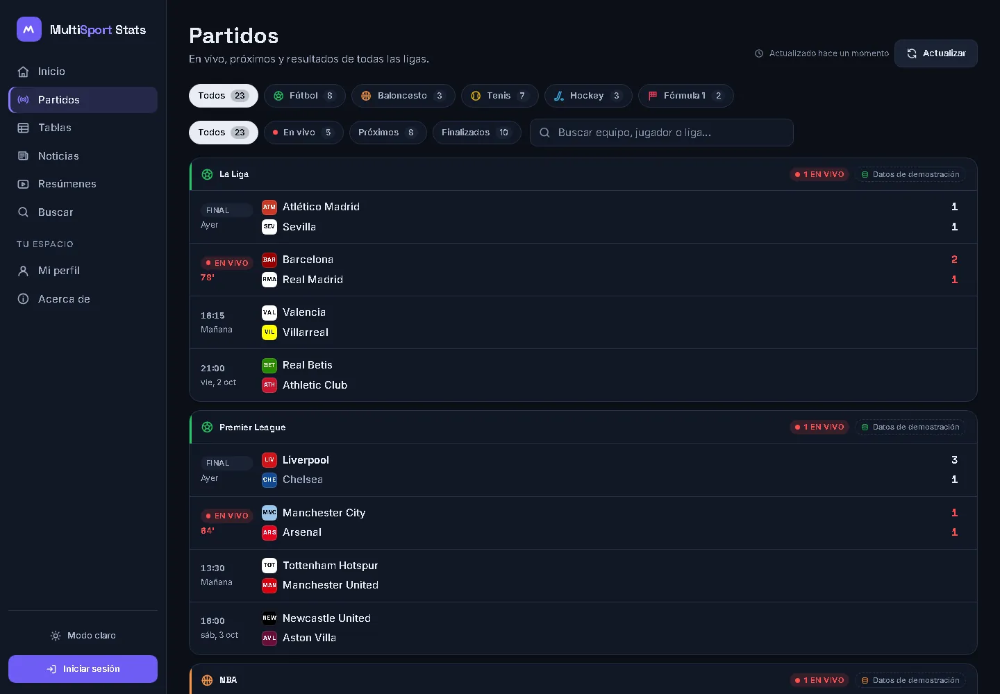
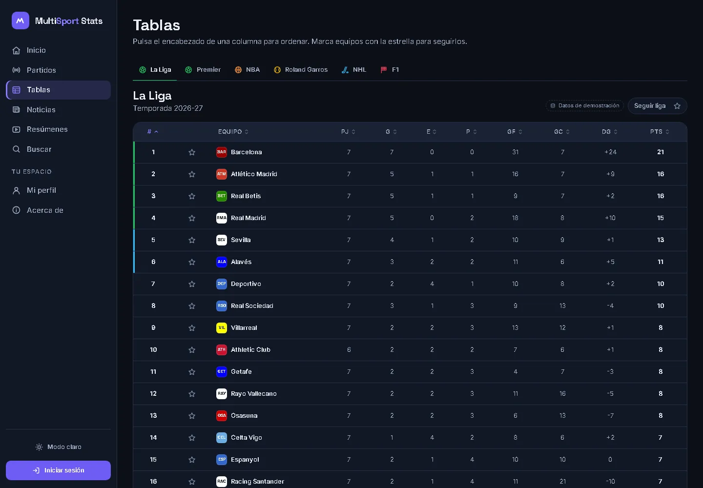
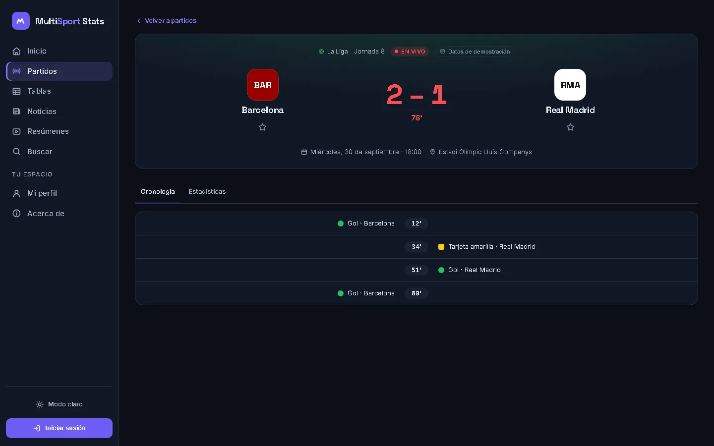
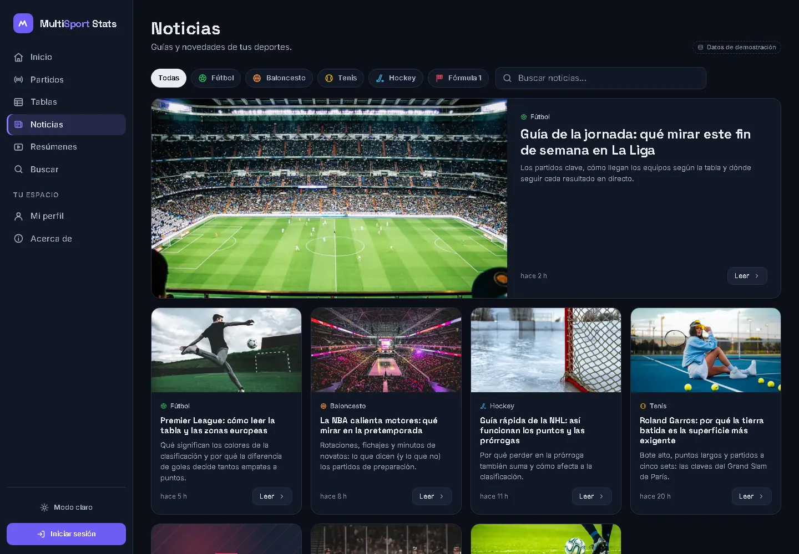
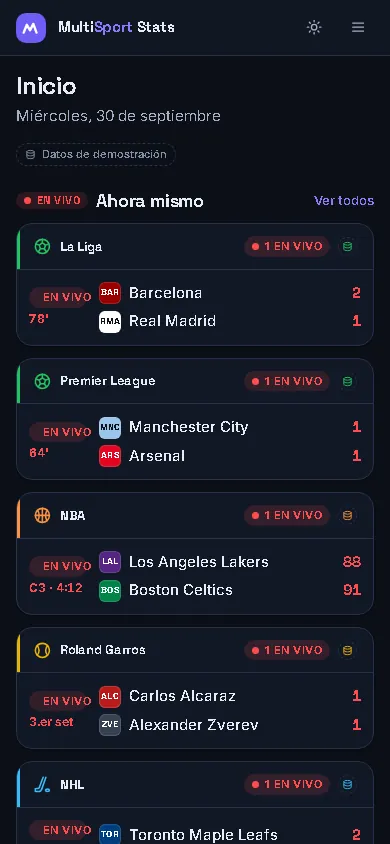

# MultiSport Stats

Marcadores, calendarios y clasificaciones de **fútbol (La Liga y Premier League), NBA, Roland Garros, NHL y Fórmula 1** en una sola web.

Está hecha con HTML, CSS y JavaScript sin frameworks: no hay build, no hay npm y no hay servidor propio.

- **Repositorio:** https://github.com/0scar07/MultiSportStats
- **Web (GitHub Pages):** https://0scar07.github.io/MultiSportStats/dashboard.html



## Capturas

| Partidos | Tablas | Ficha de partido |
|---|---|---|
|  |  |  |

| Noticias | Móvil |
|---|---|
|  |  |

## Qué incluye

- **Inicio:** partidos en vivo, próximos y resultados recientes, tus favoritos y una mini clasificación.
- **Partidos:** filtros por deporte y por estado (En vivo, Próximos, Finalizados) y búsqueda por equipo o liga. Los filtros se guardan en la URL. Si hay partidos en vivo con datos reales, se actualiza sola cada minuto y el marcador se anima cuando cambia.
- **Tablas:** clasificaciones que se ordenan pulsando cualquier columna. Tienen zonas europeas y de descenso, filtro por conferencia (NBA y NHL) y el cuadro de Roland Garros.
- **Ficha de partido** (`match.html?id=…`): cronología (goles, tarjetas, cambios), estadísticas y resultados de carrera en F1.
- **Noticias:** filtro por deporte, búsqueda y lectura en un diálogo.
- **Resúmenes:** los partidos terminados enlazan a su búsqueda de resumen en YouTube.
- **Buscar:** equipos, pilotos, tenistas, partidos y noticias.
- **Favoritos:** equipos, deportistas o ligas, guardados en `localStorage`. Aparecen primero en el inicio.
- **Tema oscuro por defecto** y tema claro opcional (se guarda en `localStorage`).
- **Cuenta demo** (ver más abajo).

## De dónde salen los datos

| Fuente | Qué aporta | Clave |
|---|---|---|
| [ESPN](https://site.api.espn.com) (API pública **no oficial**) | Marcadores, fichas y tablas de La Liga, Premier League, NBA y NHL | No necesita |
| [Jolpica F1](https://github.com/jolpica/jolpica-f1) (sucesora de Ergast) | Clasificación de pilotos, última y próxima carrera | No necesita |
| `data/*.json` | Datos de demostración: Roland Garros, noticias y respaldo de todas las ligas | — |

- Las dos APIs aceptan peticiones desde el navegador (CORS abierto) y **no requieren claves secretas**.
- La de ESPN no está documentada y puede cambiar sin aviso. Si una API falla, esa liga pasa automáticamente a los JSON de respaldo.
- Todo lo que viene de los JSON lleva la etiqueta **«Datos de demostración»**.
- Los partidos demo usan fechas relativas a hoy (`day` + `time`), así que la demo no caduca.
- Para ver **solo datos de demostración**, añade `?demo=1` a cualquier URL o elige esa opción en *Mi perfil → Preferencias*.
- No se usan logos oficiales: los escudos son monogramas con las siglas y el color de cada equipo.

## Cuentas demo (login y registro)

No hay backend: las cuentas **solo existen en el navegador** donde se crean.

- La contraseña **no se guarda en texto plano**. Se guarda un hash PBKDF2-SHA-256 con salt aleatorio, usando la Web Crypto API.
- Esto **no es seguridad real**: cualquiera con acceso a ese navegador puede ver o borrar los datos. La interfaz lo avisa y pide no reutilizar contraseñas.
- Los favoritos y las preferencias funcionan sin cuenta. La cuenta solo añade nombre visible y avatar.
- *Mi perfil → Datos locales* borra todo lo guardado por la app.

## Estructura

```
MultiSportStats/
├── dashboard.html        # Inicio (entrada de la app)
├── live.html             # Partidos: en vivo, próximos y resultados
├── standings.html        # Tablas de posiciones
├── match.html            # Ficha de partido o carrera (?id=)
├── news.html             # Noticias
├── highlights.html       # Resúmenes (enlaces a YouTube)
├── search.html           # Buscador
├── profile.html          # Cuenta demo, favoritos y preferencias
├── about.html            # Acerca de
├── login.html            # Inicio de sesión (demo)
├── register.html         # Registro (demo)
├── css/
│   ├── base.css          # Tokens de diseño, temas oscuro/claro, reset y tipografía
│   ├── components.css    # Sidebar, tarjetas, tablas, botones, filtros, badges, skeletons…
│   └── pages/            # Solo estilos específicos de cada página
├── js/
│   ├── core/
│   │   ├── theme-init.js # Aplica el tema guardado antes de pintar
│   │   ├── config.js     # Deportes, ligas y menú
│   │   ├── layout.js     # Sidebar único, menú móvil, tema y favoritos
│   │   ├── ui.js         # Componentes: filas de partido, badges, tabla ordenable, estados
│   │   ├── api.js        # Clientes de ESPN y Jolpica, normalizados
│   │   ├── data.js       # API con respaldo en JSON
│   │   ├── store.js      # localStorage: favoritos, preferencias, sesión
│   │   ├── auth.js       # Cuentas demo con hash PBKDF2
│   │   └── util.js       # Escape de HTML, íconos, fechas en español
│   └── pages/            # Un módulo por página
├── data/
│   ├── teams.json        # Equipos, pilotos y tenistas (sigla y color)
│   ├── matches.json      # Partidos demo (fechas relativas a hoy)
│   ├── news.json         # Noticias demo
│   └── standings/        # Tablas demo por liga
├── assets/
│   ├── icons.svg         # Sprite de íconos SVG propios
│   ├── favicon.svg
│   └── img/news/         # Fotos en WebP
└── docs/screenshots/     # Capturas del README
```

El `index.html` de la raíz se deja libre a propósito para la futura landing page. Hasta que exista, la app se abre en `dashboard.html`.

## Cómo correrlo en local

La app usa módulos ES y `fetch` de archivos JSON, así que **no funciona abriendo el HTML con doble clic** (`file://`). Hace falta un servidor estático. Cualquiera de estas opciones sirve:

```bash
python -m http.server 8000
```

Luego abre http://localhost:8000/dashboard.html

También puedes usar la extensión **Live Server** de VS Code (clic derecho en `dashboard.html` → *Open with Live Server*).

## Publicar en GitHub Pages

1. *Settings → Pages → Build and deployment*: fuente **Deploy from a branch**, rama **master**, carpeta **/ (root)**.
2. La app queda en https://0scar07.github.io/MultiSportStats/dashboard.html.

Todas las rutas son relativas, así que funciona tanto en la subcarpeta de Pages como en local.

## Accesibilidad

- HTML semántico, enlace para saltar al contenido y foco visible en todos los controles.
- Formularios con etiquetas asociadas y mensajes de error anunciados.
- Pestañas navegables con flechas.
- Tablas con `aria-sort`.
- Contraste AA en ambos temas.
- Se respeta `prefers-reduced-motion`.

## Créditos

- Fotos de [Unsplash](https://unsplash.com) (licencia Unsplash).
- Tipografías [Space Grotesk](https://fonts.google.com/specimen/Space+Grotesk) e [Inter](https://fonts.google.com/specimen/Inter) (Google Fonts).
- Datos: ESPN (no oficial) y [Jolpica F1](https://github.com/jolpica/jolpica-f1).
- MultiSport Stats no está afiliado a ninguna liga, equipo ni medio.

Equipo: Oscar Llanos, Nelson Sierra y Joseph De La Rans.
